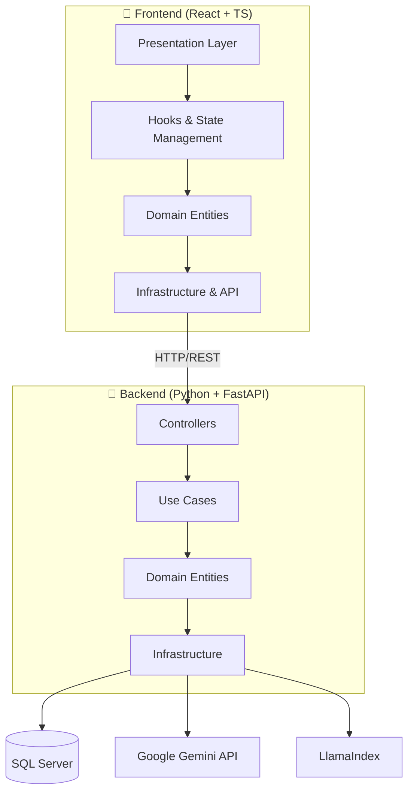

<div align="center">

# 🤖 **Chatbot SQL Intelligence**

<div align="center">
  
</div>

<br>

[](https://python.org)
[](https://fastapi.tiangolo.com)
[](https://reactjs.org)
[](https://typescriptlang.org)
[](https://vitejs.dev)
[](https://tailwindcss.com)
[](https://gemini.google.com)
[](https://llamaindex.ai)

<br>

**🚀 Um sistema de chatbot inteligente que converte linguagem natural em consultas SQL usando IA avançada**

<br>


</div>

---

## 📋 **Índice**

<details>
<summary>🔍 Clique para expandir</summary>

- [🎯 Visão Geral](#-visão-geral)
- [✨ Funcionalidades](#-funcionalidades)
- [🏗️ Arquitetura](#️-arquitetura)
- [🛠️ Tecnologias](#️-tecnologias)
- [🔧 Instalação](#-instalação)
- [🚀 Como Usar](#-como-usar)
- [📁 Estrutura do Projeto](#-estrutura-do-projeto)
- [🔒 Segurança](#-segurança)
- [🤝 Contribuindo](#-contribuindo)
- [📄 Licença](#-licença)

</details>

---

## 🎯 **Visão Geral**

<div align="center">
  
</div>

O **Chatbot SQL Intelligence** é uma aplicação full-stack revolucionária que permite aos usuários interagir com bancos de dados SQL usando linguagem natural. Powered by **Google Gemini** e **LlamaIndex**, o sistema traduz perguntas cotidianas em consultas SQL precisas, tornando a análise de dados acessível para todos.

### 🌟 **Principais Características**

- 🧠 **IA Avançada**: Integração com Google Gemini 2.5 Flash para processamento de linguagem natural
- 📊 **Análise Inteligente**: Interpretação contextual de dados e geração de insights
- 💬 **Interface Conversacional**: Chat intuitivo com histórico persistente
- 📱 **Design Responsivo**: Interface moderna e adaptável
- 🔄 **Tempo Real**: Streaming de respostas para experiência fluida
- 📁 **Suporte a Arquivos**: Upload de imagens, documentos e snippets de código
- 🎨 **Temas Customizáveis**: Interface dark/light com animações suaves

---

## ✨ **Funcionalidades**

<div align="center">
  
</div>

### 🤖 **Backend (Python + FastAPI)**

<table align="center">
<tr>
<td width="50%">

#### 🧠 **Processamento IA**
- ✅ Integração Google Gemini 2.5 Flash
- ✅ LlamaIndex para RAG (Retrieval-Augmented Generation)
- ✅ Context enhancement para consultas complexas
- ✅ Memory buffer otimizado
- ✅ ReAct Agent com ferramentas personalizadas

#### 🗄️ **Gerenciamento de Dados**
- ✅ Conexão SQL Server (pyodbc)
- ✅ Geração automática de esquemas
- ✅ Cache inteligente de consultas
- ✅ Exportação multi-formato (Excel, CSV, PDF)
- ✅ Análise de performance de queries

</td>
<td width="50%">

#### 🏗️ **Arquitetura Limpa**
- ✅ Clean Architecture (DDD)
- ✅ Dependency Injection Container
- ✅ Separação de responsabilidades
- ✅ Interfaces bem definidas
- ✅ Repository Pattern

#### 🔧 **Ferramentas Avançadas**
- ✅ Upload e processamento de arquivos
- ✅ Reconhecimento de voz
- ✅ Análise de imagens
- ✅ Sistema de sessões
- ✅ Rate limiting e quota management

</td>
</tr>
</table>

### 🎨 **Frontend (React + TypeScript)**

<table align="center">
<tr>
<td width="50%">

#### 💬 **Interface de Chat**
- ✅ Chat em tempo real com streaming
- ✅ Histórico persistente de conversas
- ✅ Sistema de sessões com pin/unpin
- ✅ Busca em conversas
- ✅ Renomeação de sessões
- ✅ Markdown rendering com syntax highlighting

#### 📁 **Gerenciamento de Arquivos**
- ✅ Drag & drop de arquivos
- ✅ Preview de imagens
- ✅ Suporte a múltiplos formatos
- ✅ Editor de código integrado
- ✅ Snippets de código reutilizáveis

</td>
<td width="50%">

#### 🎨 **Design & UX**
- ✅ Design responsivo e moderno
- ✅ Animações com Framer Motion
- ✅ Tema dark/light customizável
- ✅ Componentes reutilizáveis
- ✅ Estados de loading inteligentes
- ✅ Notificações toast

#### ⚡ **Performance**
- ✅ Code splitting automático
- ✅ Bundle optimization com Vite
- ✅ Lazy loading de componentes
- ✅ Memoização inteligente
- ✅ Debounce em inputs

</td>
</tr>
</table>

---

## 🏗️ **Arquitetura**

<div align="center">
  
</div>

### 📐 **Padrões Arquiteturais**



### 🎯 **Clean Architecture (Backend)**

- **🎪 Presentation**: Controllers para exposição da API
- **🎯 Application**: Use Cases e interfaces de negócio
- **🏰 Domain**: Entidades e regras de negócio centrais
- **🔧 Infrastructure**: Adapters, services e integrações externas

### ⚛️ **Component Architecture (Frontend)**

- **🎨 Components**: UI components reutilizáveis
- **🎣 Hooks**: Lógica de estado e efeitos
- **🏗️ Core**: Domain logic e entities
- **🌐 Infrastructure**: API clients e repositories

---

## 🛠️ **Tecnologias**

<div align="center">
  
</div>

### 🐍 **Backend Stack**

<div align="center">

| Categoria | Tecnologia | Versão | Descrição |
|-----------|------------|--------|------------|
| **🚀 Framework** |  | 0.118.0 | API moderna e performática |
| **🤖 IA/ML** |  | 0.8.5 | Modelo de linguagem avançado |
| **🦙 RAG** |  | 0.14.4 | Framework para RAG |
| **🗄️ Database** |  | - | Banco de dados principal |
| **📊 Data** |  | 2.3.3 | Manipulação de dados |
| **🔧 ORM** |  | 2.0.43 | Object-Relational Mapping |
| **⚡ ASGI** |  | 0.37.0 | Servidor ASGI |

</div>

### ⚛️ **Frontend Stack**

<div align="center">

| Categoria | Tecnologia | Versão | Descrição |
|-----------|------------|--------|------------|
| **⚛️ Framework** |  | 19.1.1 | Biblioteca UI reativa |
| **📝 Language** |  | 5.9.3 | Tipagem estática |
| **⚡ Build** |  | 7.1.7 | Build tool moderna |
| **🎨 Styling** |  | 3.4.18 | Framework CSS utility-first |
| **🎭 Animation** |  | 12.23.22 | Animações fluidas |
| **📡 HTTP** |  | 1.12.2 | Cliente HTTP |
| **🎯 Icons** |  | 0.544.0 | Ícones modernos |
| **📝 Markdown** |  | 10.1.0 | Renderização Markdown |

</div>

---

## 🔧 **Instalação**

<div align="center">
  
</div>

### 📋 **Pré-requisitos**

```bash
# Versões mínimas requeridas
Python >= 3.9
Node.js >= 18.0
npm >= 8.0
SQL Server (local ou remoto)
```

### 🔑 **Configuração da API Google Gemini**

1. Acesse [Google AI Studio](https://makersuite.google.com/app/apikey)
2. Crie uma nova API Key
3. Configure as permissões necessárias

### 🚀 **Instalação do Backend**

```bash
# 📁 Navegue até a pasta backend
cd backend

# 🐍 Crie um ambiente virtual
python -m venv venv

# 🔄 Ative o ambiente virtual
# Windows
.\venv\Scripts\activate
# Linux/Mac
source venv/bin/activate

# 📦 Instale as dependências
pip install -r requirements.txt

# ⚙️ Configure as variáveis de ambiente
cp .env.example .env
# Edite o arquivo .env com suas configurações

# 🚀 Inicie o servidor
uvicorn main:app --reload --host 127.0.0.1 --port 8000
```

### 🎨 **Instalação do Frontend**

```bash
# 📁 Navegue até a pasta frontend
cd frontend

# 📦 Instale as dependências
npm install

# ⚙️ Configure as variáveis de ambiente (opcional)
cp .env.example .env.local

# 🚀 Inicie o servidor de desenvolvimento
npm run dev
```

### 🔧 **Configuração do Banco de Dados**

```sql
-- Exemplo de configuração SQL Server
CREATE DATABASE ChatbotSQL;
USE ChatbotSQL;

-- Crie suas tabelas de dados aqui
-- O sistema detectará automaticamente o esquema
```

---

## 🚀 **Como Usar**

<div align="center">
  
</div>

### 💬 **Exemplos de Perguntas**

```
🔍 "Mostre os 10 clientes com maior faturamento"
📊 "Qual foi a receita total do último mês?"
📈 "Analise as vendas por região"
🎯 "Quais produtos têm baixo estoque?"
💰 "Compare as vendas deste ano com o anterior"
📋 "Exporte os dados de clientes para Excel"
```

### 🎨 **Funcionalidades da Interface**

- **💬 Chat Inteligente**: Digite perguntas em linguagem natural
- **📁 Upload de Arquivos**: Arraste e solte imagens/documentos
- **💾 Sessões**: Organize conversas por tópicos
- **📌 Pin Conversas**: Marque conversas importantes
- **🔍 Busca**: Encontre conversas rapidamente
- **🎨 Temas**: Alterne entre modo claro/escuro
- **📱 Responsivo**: Use em qualquer dispositivo

---

## 📁 **Estrutura do Projeto**

<div align="center">
  
</div>

```
chatbot-sql/
├── 📄 README.md                 # Documentação principal
├── 📄 .gitignore               # Arquivos ignorados pelo Git
├── 🐍 backend/                 # Aplicação Python + FastAPI
│   ├── 📄 main.py             # Ponto de entrada da aplicação
│   ├── 📄 requirements.txt    # Dependências Python
│   ├── 📄 config.py          # Configurações do sistema
│   ├── 📄 agent.py           # Agente IA com LlamaIndex
│   └── 📁 src/               # Código fonte organizado
│       ├── 🏛️ domain/        # Entidades e regras de negócio
│       ├── 🎯 application/   # Use cases e interfaces
│       ├── 🔧 infrastructure/ # Adapters e services
│       ├── 🎪 presentation/  # Controllers da API
│       └── 🤝 shared/        # Utilitários compartilhados
└── ⚛️ frontend/               # Aplicação React + TypeScript
    ├── 📄 package.json       # Dependências Node.js
    ├── 📄 vite.config.ts     # Configuração do Vite
    ├── 📄 tailwind.config.js # Configuração do Tailwind
    ├── 📄 tsconfig.json      # Configuração TypeScript
    └── 📁 src/              # Código fonte React
        ├── 🎨 components/   # Componentes reutilizáveis
        ├── 🎣 hooks/        # Custom hooks
        ├── 🏗️ core/        # Lógica de domínio
        ├── 🌐 infrastructure/ # Clients e repositories
        ├── 🎭 presentation/ # Hooks de apresentação
        └── 🤝 shared/      # Utilitários e constantes
```

---

## 🔒 **Segurança**

<div align="center">
  
</div>

### 🛡️ **Medidas de Segurança Implementadas**

- 🔐 **Variáveis de Ambiente**: Todas as chaves sensíveis em arquivos .env
- 🚫 **Sanitização**: Prevenção contra SQL Injection
- ⏱️ **Rate Limiting**: Controle de requisições por IP
- 🔒 **CORS**: Configuração adequada para produção
- 🛡️ **Validação**: Validação rigorosa de inputs
- 📝 **Logging**: Sistema de logs para auditoria
- 🔄 **Timeout**: Controle de timeout em operações

### 🔧 **Configurações de Segurança**

```python
# Exemplo de configurações no backend
CORS_ORIGINS = ["http://localhost:3000"]  # Apenas origens confiáveis
RATE_LIMIT = "100/hour"                   # Limite de requisições
SESSION_TIMEOUT = 3600                    # Timeout de sessão
MAX_FILE_SIZE = 10 * 1024 * 1024         # 10MB máximo por arquivo
```

---

## 🤝 **Contribuindo**

<div align="center">
  
</div>

### 🎯 **Como Contribuir**

1. 🍴 **Fork** o projeto
2. 🌿 **Crie** uma branch para sua feature (`git checkout -b feature/AmazingFeature`)
3. 📝 **Commit** suas mudanças (`git commit -m 'Add some AmazingFeature'`)
4. 📤 **Push** para a branch (`git push origin feature/AmazingFeature`)
5. 🔄 **Abra** um Pull Request

### 📋 **Padrões de Desenvolvimento**

- ✅ **Clean Code**: Siga os princípios de código limpo
- 🧪 **Testes**: Adicione testes para novas funcionalidades
- 📝 **Documentação**: Documente APIs e componentes
- 🎨 **Linting**: Use ESLint (frontend) e Black (backend)
- 🔍 **Type Safety**: Mantenha tipagem rigorosa

---

## 📄 **Licença**

<div align="center">
  
</div>

<div align="center">

**MIT License** © 2025 [VInicius Rolim Barbosa](https://github.com/Viniirb)

Este projeto está licenciado sob a Licença MIT - veja o arquivo [LICENSE](LICENSE) para detalhes.

---

### 📞 **Contato & Suporte**

[](https://github.com/Viniirb)
[](https://www.linkedin.com/in/vinicius-rolim-barbosa-15b066374/)
[](mailto:viiniirb@proton.me)

---

<div align="center">
  
</div>

**⭐ Se este projeto foi útil, deixe uma estrela!**

</div>